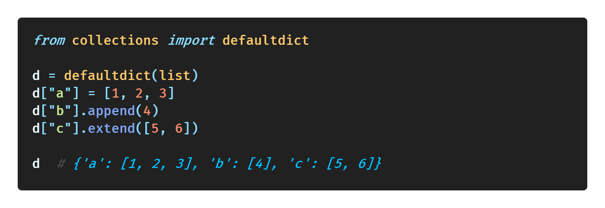
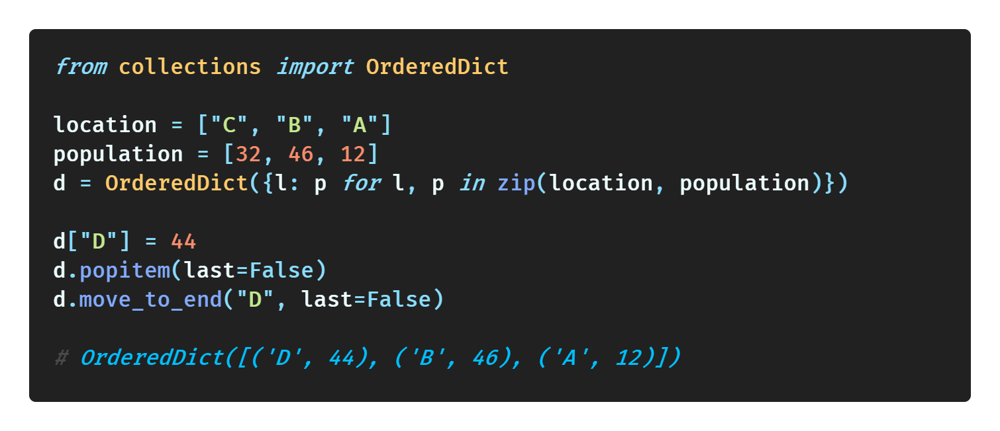
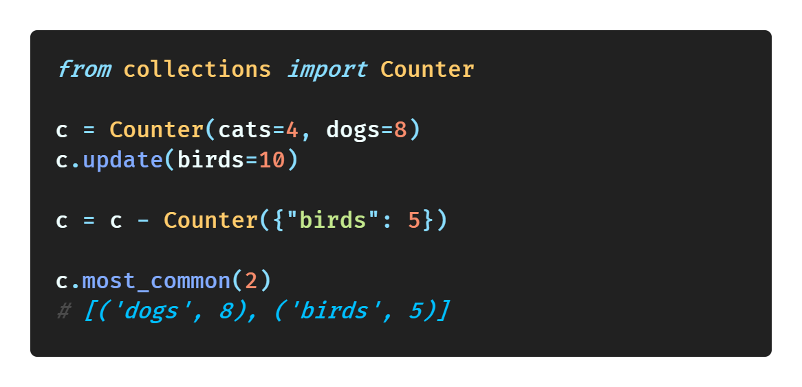
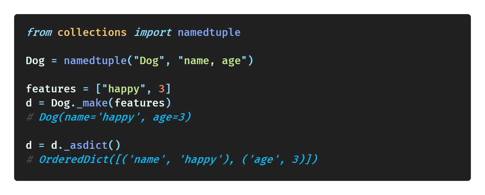
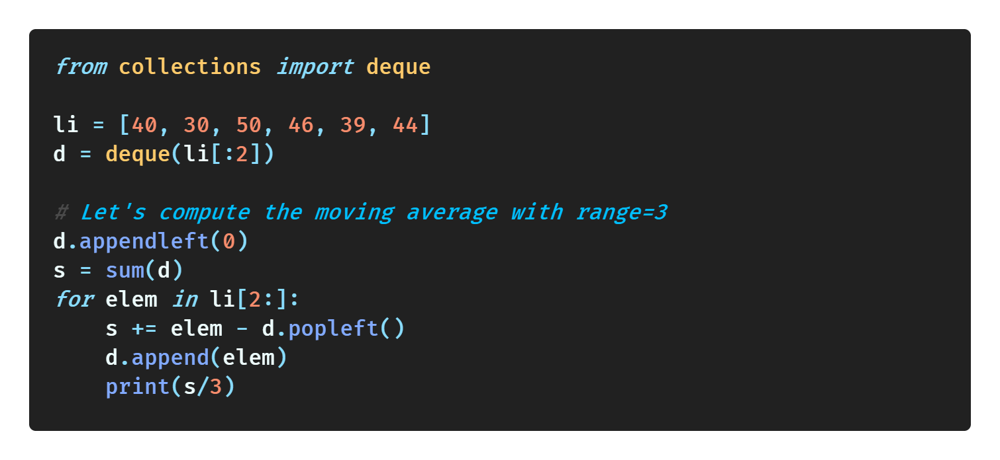

In this Python Universe, I want to learn and show you all the Python skills.

All skills are base on the implementation of Python 3.

# Table of contents

<!-- \[(.*)\]\((.*)\) -->
<!-- <li><a href="$2">$1</li> -->

<table>
<tr><th>Must Know</th><th>Classes</th><th>Functions</th></tr>
<tr>
<td>
<ul style="margin: 8px">
<li><a href="#list--dict--set-comprehensions">List & Dict & Set Comprehensions</li>
<li><a href="#lambda-functions">Lambda Functions</li>
<li><a href="#map">Map</li>
<li><a href="#filter">Filter</li>
<li><a href="#zip">Zip</li>
<li><a href="#reduce">Reduce</li>
<li><a href="#args--kwargs">*args & **kwargs</li>
<li><a href="#generator-map-filter-zip">Generator (map, filter, zip)</li>
<li><a href="#closure--decorator">Closure & Decorator</li>
<li><a href="#context-manager">Context Manager</li>
<li><a href="#magic-method">Magic Method</li>
<li><a href="#metaclasses">Metaclasses</li>
<li><a href="#threading--multiprocessing">Threading & Multiprocessing</li>
</ul>
</td>

<td>
<ul style="margin: 8px">
<li><a href="#self-class-instance">self (class instance)</li>
<li><a href="#variables-class--instance">variables (class & instance)</li>
<li><a href="#method-vs-classmethod-vs-staticmethod">method vs. classmethod vs. staticmethod</li>
<li><a href="#\_-private-vs-\__-name-mangling">_ (private) vs. __ (name mangling)</li>
<li><a href="#property-getter-setter">@property (getter, setter)</li>
<li><a href="#legb-local-enclosing-global-builtins">LEGB (local, enclosing, global, builtins)</li>
<li><a href="#abstract-class">Abstract class</li>
<li><a href="#dataclasses">Dataclasses</li>
<li><a href="#classes-in-dynamic-language">Classes in Dynamic Language</li>
</ul>
</td>

<td>
<ul style="margin: 8px">
<li><a href="#enclosing-function">Enclosing function</li>
<li><a href="#attrs">Attrs</li>
<li><a href="#functions-in-dynamic-language">Functions in Dynamic Language</li>
</ul>
</td>

</tr>
</table>

* [Table of contents](#table-of-contents)
* [Must Know](#must-know)
  * [List & Dict & Set Comprehensions](#list--dict--set-comprehensions)
  * [Lambda Functions](#lambda-functions)
  * [Map](#map)
  * [Filter](#filter)
  * [Zip](#zip)
  * [Reduce](#reduce)
  * [*args & **kwargs](#args--kwargs)
  * [Generator (map, filter, zip)](#generator-map-filter-zip)
  * [Closure & Decorator](#closure--decorator)
  * [Context Manager](#context-manager)
  * [Magic Method](#magic-method)
  * [Metaclasses](#metaclasses)
  * [Threading & Multiprocessing](#threading--multiprocessing)
* [Classes](#classes)
  * [self (class instance)](#self-class-instance)
  * [variables (class & instance)](#variables-class--instance)
  * [method vs. classmethod vs. staticmethod](#method-vs-classmethod-vs-staticmethod)
  * [_ (private) vs. __ (name mangling)](#_-private-vs-__-name-mangling)
  * [@property (getter, setter)](#property-getter-setter)
  * [LEGB (local, enclosing, global, builtins)](#legb-local-enclosing-global-builtins)
  * [Abstract class](#abstract-class)
  * [Dataclasses](#dataclasses)
  * [Classes in Dynamic Language](#classes-in-dynamic-language)
* [Functions](#functions)
  * [Enclosing function](#enclosing-function)
  * [Attrs](#attrs)
  * [Functions in Dynamic Language](#functions-in-dynamic-language)
  * [Collections](#collections)
  * [Itertools](#itertools)
  * [os](#os)
  * [Conditions](#conditions)
  * [String](#string)
  * [Int](#int)
  * [List](#list)
  * [Set](#set)
  * [Tuple](#tuple)
  * [Dict](#dict)
  * [Try](#try)
  * [Design](#design)
  * [IPython](#ipython)
  * [TODOs](#todos)

# Must Know

## [List & Dict & Set Comprehensions](must_know/list_dict_set_comprehensions.md)

``` py
[(i, j) for i in range(3) for j in range(3) if i > j]

# [(1, 0), (2, 0), (2, 1)]
```

## [Lambda Functions](must_know/lambda_functions.md)

``` py
li = [1, 2, 3]
li = [*map(lambda x: x * 10, li)]

#li = [10, 20, 30]
```

## [Map](must_know/map.md)

``` py
num1 = [100, 1, 20]
num2 = [19, 4, 94]
num3 = [40, 6, 30]

[*map(lambda x, y, z: max(x, y, z), num1, num2, num3)]
# [100, 6, 94]
```

## [Filter](must_know/filter.md)

``` py
names = ['Liam', 'Olivia', 'Noah', 'Emma', 'Oliver', 'Ava']
choice = filter(lambda x: x.startswith('O'), names)

print(*choice, sep=', ') # Olivia, Oliver
```

## [Zip](must_know/zip.md)

``` py
a = [1, 2, 3]
b = [4, 5, 6]

c = [*zip(a, b)]  # [(1, 4), (2, 5), (3, 6)]
a, b = zip(*c)    # a=(1, 2, 3),  b=(4, 5, 6)
```

## [Reduce](must_know/reduce.md)

``` py
from functools import reduce
reduce(lambda x, y: x - y, [1, 2, 3, 4, 5], 100)  # 85
```

## [*args & **kwargs](must_know/arg_kwarg.md)

``` py
def example(a, *arg, b=0, **kwarg):
    print(a)     # 1
    print(arg)   # (2, 3)
    print(b)     # 1
    print(kwarg) # {'x': 'a', 'y': [1, 2, 3]}

example(1, 2, 3, b=1, x='a', y=[1, 2, 3])
```

## [Generator (map, filter, zip)](must_know/generator.md)

``` py
def square_it(value):
    for i in range(value):
        yield i**2

li = square_it(10_000_000)

[i for i in li if i < 50]  # [0, 1, 4, 9, 16, 25, 36, 49]
```

## [Closure & Decorator](must_know/closure_decorator.md)

``` py
def count_decorator(count):  # new decorator with argument
    def decorator(orig_func):
        def wrapper(*args, **kwargs):
            print(f"func name: {orig_func.__name__}")
            print(f"func args: {args}, {kwargs}")

            for _ in range(count):  # use the argument
                orig_func(*args, **kwargs)

        return wrapper
    return decorator  # return the original decorator

@count_decorator(2)
def greet(msg):
    print(msg)


greet("hello")
# func name: greet
# func args: ('hello',), {}
# hello
# hello
```

## [Context Manager](must_know/context_manager.md)

``` py
@contextmanager
def enterFolder(folderName):
    home = os.getcwd()
    os.chdir(folderName)
    yield
    os.chdir(home)

with enterFolder('folder1'), open('example1.txt', 'w') as f:
    f.write('file1')
```

## [Magic Method](must_know/magic_method.md)

``` py
class BinaryInt(str):
    def __new__(cls, val):
        return str.__new__(cls, f"{val: b}")

    def __add__(self, val):
        val += int(self, 2)
        return f"{val:b}"


a = BinaryInt(2)
print(a)      # 10
print(a + 4)  # 110
```

## [Metaclasses](must_know/metaclasses.md)

``` py
class Meta(type):
    def __new__(mtcls, name, bases, attrs):
        if name != "Base" and "must_to_do" not in attrs:
            raise TypeError("Bad Class: must_to_do() is needed")
        return super().__new__(mtcls, name, bases, attrs)


class Base(metaclass=Meta):
    def server_func(self):
        return self.must_to_do()


class Derived(Base):
    ...
# TypeError: Bad Class: must_to_do() is needed
```

## [Threading & Multiprocessing](must_know/threading_multiprocessing.md)

``` py
import concurrent.futures

with concurrent.futures.ThreadPoolExecutor(max_workers=5) as executor:
    futures = [executor.submit(load_url, url, 60) for url in URLS]
    for future in concurrent.futures.as_completed(futures):
        result = future.result()
        print(len(result))


with concurrent.futures.ProcessPoolExecutor() as executor:
    results = executor.map(load_url, URLS, [60] * len(URLS), chunksize=4)
    for result in results:
        print(len(result))
```

# Classes

## [self (class instance)](classes/self_class_instance.md)                  

``` py
class Person:
    def __init__(self, name):
        self.name = name

    def say(self):
        return f"I'm {self.name}"


p = Person("Jay")
p.say() == Person.say(p)  # True
```

## [variables (class & instance)](classes/variables_class_instance.md)       

``` py
class Employee:
    num_emp = 0  # Class variable

    def __init__(self, pay):
        self.pay = pay  # Instance variable
        Employee.num_emp += 1

e1 = Employee(100)
e2 = Employee(200)

e1.num_emp        # 2
Employee.num_emp  # 2

e1.pay  # 100
Employee.pay  # AttributeError: type object 'Employee' has no attribute 'pay'
```

## [method vs. classmethod vs. staticmethod](classes/method_class_static.md) 

``` py
class Person:
    def __init__(self, name, age):
        self.name = name
        self.age = age

    @staticmethod
    def splitPersonString(string, split_sign="-"):
        return string.split(split_sign)

    @classmethod
    def fromString(cls, cls_str):
        return cls(*cls.splitPersonString(cls_str, ", "))


p1 = Person.fromString("Jay, 99")
p1.name  # Jay
p1.age   # 99
```

## [_ (private) vs. __ (name mangling)](classes/private_name_mangling.md)    

``` py
class Dog:
    _weight = 5  # private variable

    def __bark(self):  # name mangling fucntion
        print("bark")


dog = Dog()
dog._weight       # 5
dog.__bark()      # AttributeError: 'Dog' object has no attribute '__bark'
dog._Dog__bark()  # bark
```

## [@property (getter, setter)](classes/property_getter_setter.md)           

``` py
class User:
    def __init__(self, first_name, last_name, password):
        self.first_name = first_name
        self.last_name = last_name
        self.password = password

    @property
    def fullname(self):
        return f"{self.first_name} {self.last_name}"

    @property
    def password(self):
        raise AttributeError("password is not readable.")

    @password.setter
    def password(self, passord):
        from hashlib import md5

        self.password_hash = md5(b"{password}").hexdigest()


user = User("Mimi", "Wang", "0000")
user.fullname       # Mimi Wang
user.password_hash  # 7fbccc9c3a9a5afef65563cd00404c1416
user.password       # Attribute Error: password is not readable.
```

## [LEGB (local, enclosing, global, builtins)](classes/legb.md)              

``` py
min([1, 2, 31])  # builtins min
min = "global min"

def outer():
    # we can do "global min" here to change global
    min = "enclosing min"
    
    def inner():
        # we can do "nonlocal min" here to change enclosing
        min = "local min"
```

## [Abstract class](classes/abstract_class.md)                               

``` py
from abc import ABC, abstractmethod


class Base(ABC, object):
    @property
    @abstractmethod
    def foo(self):
        ...

    @abstractmethod
    def do(self):
        ...
```

## [Dataclasses](classes/dataclasses.md)                                     

``` py
from dataclasses import InitVar, dataclass, field
from typing import List


@dataclass
class InventoryItem:
    name: str
    unit_price: float = field(default=0.0)
    quantity_on_hand: int = field(default=0, repr=False)
    parts: List[str] = field(default_factory=list)
    parts_number: InitVar[int] = 0

    def __post_init__(self, parts_number):
        self.parts.extend([f"part{i}" for i in range(1, parts_number + 1)])


item = InventoryItem("product", parts_number=2)
# InventoryItem (name = 'product', unit_price=0.0, parts=['part1', 'part2'])
```

## [Classes in Dynamic Language](classes/dynamic_language.md)                           

``` py
def getClass(x):
    if x == 1:
        for i in range(11):

            class Example:
                a = i

        return Example


cls = getClass(1)
cls.b = "123"
print(cls.a, cls.b)  # 10 123
```

# Functions

## [Enclosing function](functions/enclosing.md)  

``` py
def add_with_b(b):
    def add(a):
        return a + b
    return add

add4 = add_with_b(4)
add4(3)  # 7
add4(7)  # 11
```

## [Attrs](functions/attrs.md)                       

``` py
class Cat:
    def __repr__(self):
        return f"({self.name}: {self.age})"

listOfCats = []
attrs = [{"name": "meow1", "age": 5}, {"name": "meow2", "age": 10}]

for attr in attrs:
    cat = Cat()
    for key, val in attr.items():
        setattr(cat, key, val)
    listOfCats.append(cat)


print(listOfCats)
# [(meow1: 5), (meow2: 10)]
```

## [Functions in Dynamic Language](functions/dynamic_language.md) 

``` py
for i in range(100):
    def say():
        print(i)


def returnFunc(a):
    if a < 100:
        def mul(b):
            print(a * b)
        return mul
    else:
        def add(b):
            print(a + b)
        return add
```

## Collections

| Tricks                                    | Simple Demo                                                           |
| ----------------------------------------- | --------------------------------------------------------------------- |
| [defaultdict](collections/defaultdict.md) | [](collections/defaultdict.md) |
| [OrderedDict](collections/ordereddict.md) | [](collections/ordereddict.md) |
| [Counter](collections/counter.md)         | [](collections/counter.md)         |
| [namedtuple](collections/namedtuple.md)   | [](collections/namedtuple.md)   |
| [deque](collections/deque.md)             | [](collections/deque.md)             |

## Itertools

| Tricks                                    | Simple Demo                                 |
| ----------------------------------------- | ------------------------------------------- |
| Infinite iterators (count, cycle, repeat) |                                             |
| accumulate                                |                                             |
| chain                                     |                                             |
| compress                                  |                                             |
| filterfalse                               |                                             |
| groupby                                   |                                             |
| islice                                    |                                             |
| starmap                                   |                                             |
| takewhile                                 |                                             |
| dropwhile                                 |                                             |
| zip_longest                               |                                             |
| product                                   |                                             |
| permutations                              |                                             |
| combinations                              |                                             |
| Itertools                                 | https://www.youtube.com/watch?v=Qu3dThVy6KQ |

## os

| Tricks  | Simple Demo                                   |
| ------- | --------------------------------------------- |
| pathlib | https://myapollo.com.tw/zh-tw/python-pathlib/ |

## Conditions

| Tricks               | Simple Demo                                                        |
| -------------------- | ------------------------------------------------------------------ |
| Ternary Conditionals | https://www.youtube.com/watch?v=C-gEQdGVXbk&list=LL&index=24&t=34s |

## String

| Tricks  | Simple Demo                                                                                                                              |
| ------- | ---------------------------------------------------------------------------------------------------------------------------------------- |
| fstring | https://blog.louie.lu/2017/08/08/outdate-python-string-format-and-fstring/, https://www.youtube.com/watch?v=nghuHvKLhJA&list=LL&index=19 |
| getpass | https://www.youtube.com/watch?v=C-gEQdGVXbk&list=LL&index=24&t=1584s                                                                     |

## Int

| Tricks                  | Simple Demo                                                         |
| ----------------------- | ------------------------------------------------------------------- |
| Underscore Placeholders | https://www.youtube.com/watch?v=C-gEQdGVXbk&list=LL&index=24&t=133s |

## List

| Tricks     | Simple Demo                                                                                                     |
| ---------- | --------------------------------------------------------------------------------------------------------------- |
| enumerate  | https://www.youtube.com/watch?v=C-gEQdGVXbk&list=LL&index=24&t=410s, https://youtu.be/VBokjWj_cEA?list=LL&t=189 |
| for...else | https://youtu.be/VBokjWj_cEA?list=LL&t=867                                                                      |

## Set

| Tricks            | Simple Demo                                                                                                    |
| ----------------- | -------------------------------------------------------------------------------------------------------------- |
| set for searching | https://stackoverflow.com/questions/2831212/python-sets-vs-lists/17945009, https://youtu.be/r3R3h5ly_8g?t=1010 |

## Tuple

| Tricks                                                 | Simple Demo                                |
| ------------------------------------------------------ | ------------------------------------------ |
| unpacking https://youtu.be/C-gEQdGVXbk?list=LL&t=1033, | https://youtu.be/SNTZpy0oDB8?list=LL&t=795 |
| swap                                                   | https://youtu.be/VBokjWj_cEA?list=LL&t=445 |
| assign *variable                                       |                                            |

## Dict

| Tricks | Simple Demo                                |
| ------ | ------------------------------------------ |
| get    | https://youtu.be/VBokjWj_cEA?list=LL&t=726 |

## Try

| Tricks | Simple Demo                                 |
| ------ | ------------------------------------------- |
| TEEF   | https://youtu.be/VBokjWj_cEA?list=LL&t=1331 |

## Design

| Tricks      | Simple Demo                                                                                                             |
| ----------- | ----------------------------------------------------------------------------------------------------------------------- |
| annotation  | https://mozillazg.com/2016/01/python-function-argument-type-check-base-on-function-annotations.html                     |
| typing,     | https://myapollo.com.tw/zh-tw/python-typing-module/                                                                     |
| (...), pass | https://stackoverflow.com/questions/42190783/what-does-three-dots-in-python-mean-when-indexing-what-looks-like-a-number |
| absl        | https://www.jianshu.com/p/f84a5b8c1183                                                                                  |

## IPython

| Tricks             | Simple Demo |
| ------------------ | ----------- |
| vscode python file |             |
| timeit, time       |             |
| memit              |             |

## TODOs

Numba
Numpy
Pandas
Matplotlib
sklearn
pytorch
transformers
tensorboard
mlflow
beautiful soup
requests
scrapy
selenium
streamlit
